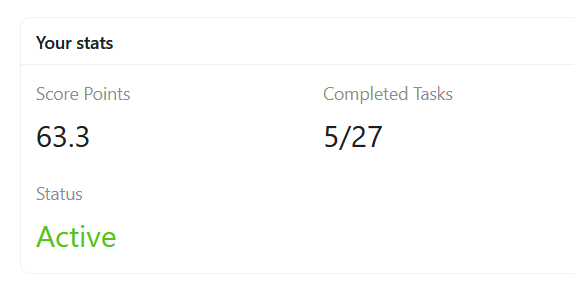

## Mamsurova Alina
----------------------------------------
#### Contact information:
* **Phone:** 89284959731
* **E-mail** alya.mamsurova@bk.ru
* **Telegram:** @myasoooooo

-----------------------------------------
#### Briefly About Myself:
I took this course in 2024 but didn't complete it. My English isn't very good, but I want to learn it. My strengths include quality work and responsibility. After completing the course, I expect to gain new knowledge that will allow me to enter the IT industry.
 
-----------------------------------------
#### Skills and Proficiency:
* HTML
* CSS
* GIT

-----------------------------------------
#### Code examples
```
const assert = require("chai").assert;

describe("Multiply", () => {
  it("fixed tests", () => {
    assert.strictEqual(multiply(1,1), 1);
    assert.strictEqual(multiply(2,1), 2);
    assert.strictEqual(multiply(2,2), 4);
    assert.strictEqual(multiply(3,5), 15); 
    assert.strictEqual(multiply(5,0), 0);
    assert.strictEqual(multiply(0,5), 0);
    assert.strictEqual(multiply(0,0), 0); 
  });
});
```

-----------------------------------------

#### Education
North Ossetian State University named after Kosta Khetagurov
Major: Mathematics and Computer Science.
University graduation: Summer 2025

-----------------------------------------
#### Courses:
* JS /FE Pre-School 2024Q2

* Html academy

-----------------------------------------
#### Languages:
* English level: A1
* Ossetian: In the blood
* Russian: Native